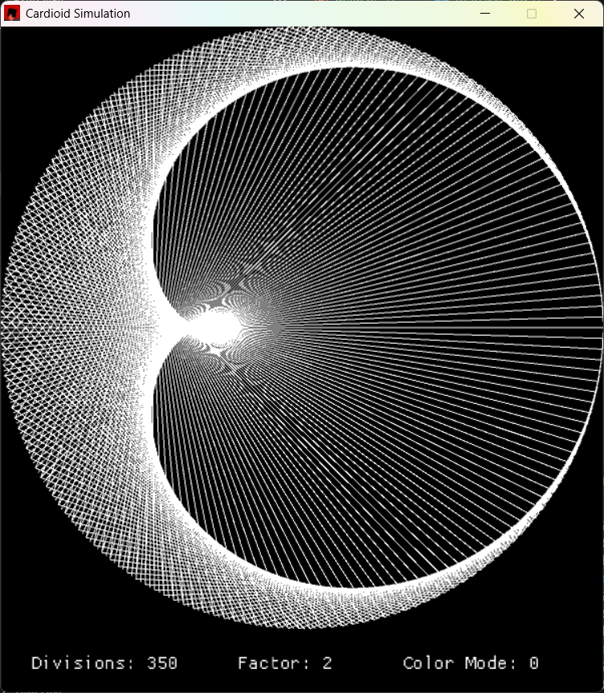
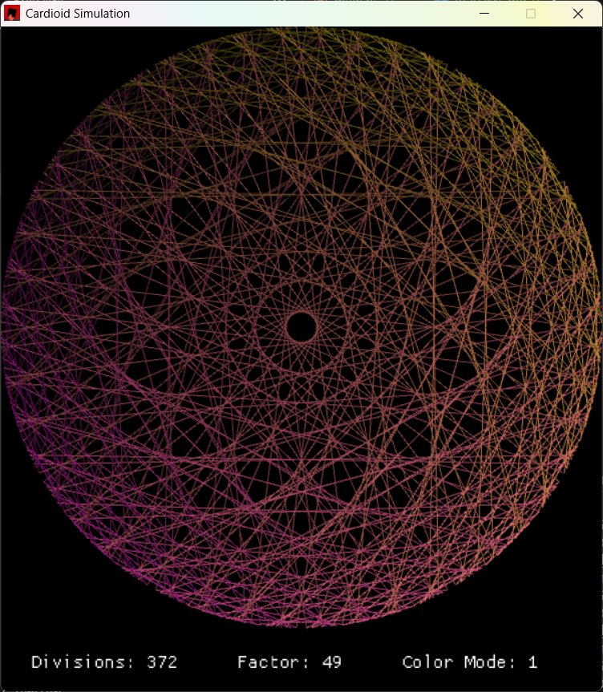
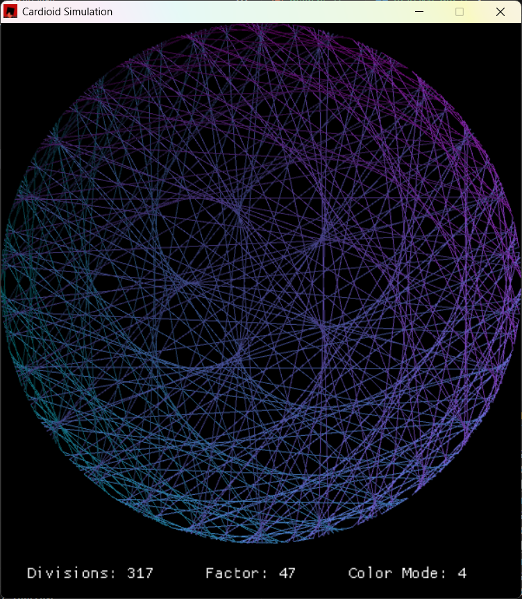

# Cardioid Simulation
Cardioid simulation visualized using Rust and Macroquad.

## Usage
- Use the left and right arrow keys to adjust the number of divisions,
- Use the up and down arrow keys to adjust the factor,
- Press **`C`** to change the color mode,
- Hold the **left shift** key down while using the arrow keys to change the divisions and factor quicker.

## Screenshots

